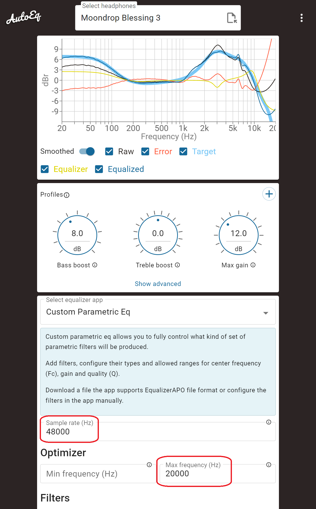

# Walkman终级调音指南

> English title: **Walkman Ultimate Tuning Guide**

> [!WARNING]
> **先备份，再动手。/ Back up first.**
>
> 按本项目文档一步一步操作，正常情况下不会把播放器刷砖；但固件修改、ADB/root、`/proc` 写入和内核模块都属于会碰系统状态的操作。为了防止断电、误操作、脚本路径选错或设备差异导致的极端情况，**强烈建议在开始 ADB 解锁、写 tone table 或安装模块之前，先按 [BACKUP.md](BACKUP.md) 备份系统分区/整机镜像**。
>
> `unknown321` 的 [Walkman Backup/Restore Tool](https://github.com/unknown321/wbrt) 可以在 Windows 上为 MT8590 系列 Walkman 做备份和还原；其说明中明确支持 NW-A30/40/50、ZX300、WM1A、WM1Z、DMP-Z1，并提示 bootloop 恢复的前提是你已经提前做过备份。Wampy 的 [BACKUP.md](https://github.com/unknown321/wampy/blob/master/BACKUP.md) 也建议在安装出问题这种极小概率事件前准备备份。
>
> Following this guide carefully should not brick the player, but firmware patching, ADB/root access, `/proc` writes, and kernel modules still touch system state. Before ADB unlock, tone-table writes, or module installation, make a system/full-device backup using [BACKUP.md](BACKUP.md).

本项目面向 Sony Walkman A / ZX / WM 系列播放器，整理了一套从 AutoEq / PEQ 参数生成 CXD3778GF 自定义调音表，并把调音表部署到播放器上的完整工具链。

This project packages a reproducible tuning workflow for Sony Walkman A / ZX / WM players: convert AutoEq / PEQ filters into custom CXD3778GF tone tables, then deploy those tables to the player.

> 风险提示 / Risk notice  
> 本项目会修改播放器音频调音路径，部分机型还需要加载自定义内核模块。请先备份原始固件、原始调音表和重要数据。所有内容按原样提供，作者不承诺适配任何设备，也不承担刷机失败、设备损坏、听力损伤或数据丢失责任。  
> This project changes the audio tuning path of the player, and some models require a custom kernel module. Back up firmware, stock tone tables, and important data first. Everything is provided as-is, without warranty.

## Too Long; Don't Read / 太长不看

目标：把耳机的 AutoEq / PEQ 参数转换成 Walkman 可读取的 tone table，然后部署到播放器。

Goal: convert headphone AutoEq / PEQ filters into a Walkman-compatible tone table and deploy it.

### 1. 准备环境 / Prepare

先完成系统备份：

Make a system/full-device backup first:

- [BACKUP.md](BACKUP.md)
- [unknown321/wbrt](https://github.com/unknown321/wbrt)
- [unknown321/wampy BACKUP.md](https://github.com/unknown321/wampy/blob/master/BACKUP.md)

```bash
cd /home/neoncloud/walkman-tuning-guide
python3 -m pip install -r requirements.txt

# Windows/WSL 用户可直接使用 E 盘 platform-tools
export ADB=/mnt/e/Downloads/platform-tools/adb.exe
```

播放器需要先开启 ADB。详细步骤见 [docs/adb-unlock.zh-en.md](docs/adb-unlock.zh-en.md)。

ADB must be enabled first. See [docs/adb-unlock.zh-en.md](docs/adb-unlock.zh-en.md).

### 2. 备份原表 / Back Up Stock Tables

```bash
mkdir -p backups
"$ADB" shell 'cat /proc/icx_audio_cxd3778gf_data/tct' > backups/proc_tct.stock.bin
"$ADB" pull /system/usr/share/audio_dac/tc_1291.tbl backups/tc_1291.stock.tbl
```

### 3. 生成调音表 / Generate a Tone Table

先从 [AutoEq](https://autoeq.app/) 下载目标耳机的 parametric EQ 文本。页面里需要关注滤波器类型、频率、增益、Q 值和 preamp，示例中红框位置就是需要复制/下载的参数。

Download the parametric EQ text for your headphone from [AutoEq](https://autoeq.app/). Pay attention to filter type, frequency, gain, Q, and preamp. The red box in the example marks the parameters used by this project.



下载后的文本通常类似：

The downloaded text usually looks like:

```text
Preamp: -2.85 dB
Filter 1: ON LSC Fc 105.0 Hz Gain 2.5 dB Q 0.70
Filter 2: ON PK Fc 234.0 Hz Gain -0.5 dB Q 0.94
Filter 3: ON PK Fc 3024.3 Hz Gain -2.3 dB Q 3.22
Filter 4: ON PK Fc 9518.3 Hz Gain 6.4 dB Q 1.42
Filter 5: ON HSC Fc 10000.0 Hz Gain -8.9 dB Q 0.70
```

从 AutoEq 文本生成五级 IIR 调音表：

Generate a five-section IIR tone table from an AutoEq text profile:

```bash
mkdir -p out backups
python3 tools/cxd3778gf_tct_tool.py make-identity backups/identity.tbl
python3 tools/autoeq_to_cxd3778gf_table.py samples/sample-autoeq.txt out/custom.tbl \
  --base-table backups/identity.tbl \
  --target sg \
  --filter-strategy best
```

如果目标来自 minimum-phase WAV 或需要拟合响应曲线，可使用：

For a minimum-phase WAV target or response fitting:

```bash
bash experiments/reproduce/15_bl3_rbj_refine_sensitive_zx300a_all_targets.sh
```

### 4. 部署到 A 系列 / Deploy to A-Series

A50 实测可以直接写入 tone table proc 节点：

On tested A50 devices, the stock proc node can apply the table directly:

```bash
bash scripts/install_tone_table.sh \
  --device-class a \
  --input samples/sample-autoeq.txt \
  --target sg
```

### 5. 部署到 ZX / WM 系列 / Deploy to ZX / WM

ZX300A 实测 stock kernel 会更新驱动内存里的表，但不会在 `TYPE_Z` 路径上自动把表刷入 CXD3778GF tone RAM。因此需要安装 helper kernel module：

On tested ZX300A devices, the stock kernel updates the in-memory table but does not reload CXD3778GF tone RAM on the `TYPE_Z` path. Install the helper kernel module:

```bash
bash scripts/build_zx300_tone_apply.sh
bash experiments/reproduce/97_install_cxd3778gf_tone_apply_module.sh
bash scripts/install_tone_table.sh \
  --device-class zx \
  --table samples/autoeq/bl3-zx300a-rbj-refine-sensitive-all-targets/full-table/tc_127x.bl3-zx300a-rbj-refine-sensitive-all-targets.tbl
```

开机自动应用：

Autoload at boot:

```bash
bash experiments/reproduce/97_install_cxd3778gf_tone_apply_autoload.sh
bash experiments/reproduce/98_set_cxd3778gf_tone_autoload_table.sh \
  samples/autoeq/bl3-zx300a-rbj-refine-sensitive-all-targets/full-table/tc_127x.bl3-zx300a-rbj-refine-sensitive-all-targets.tbl
```

### 6. 还原 / Restore

```bash
bash scripts/restore_stock_tone_table.sh --device-class zx
bash experiments/reproduce/99_uninstall_cxd3778gf_tone_apply_autoload.sh
bash experiments/reproduce/99_uninstall_cxd3778gf_tone_apply_module.sh
```

更多部署细节见 [docs/deployment.zh-en.md](docs/deployment.zh-en.md)。

For details, see [docs/deployment.zh-en.md](docs/deployment.zh-en.md).

## 简介 / Introduction

Sony Walkman A 系列、ZX 系列以及 WM 系列的多款 Linux/Android 播放器使用相近的 `cxd3778gf` 音频 codec 路径。我们在 A50 与 ZX300A 的固件、内核源码和设备实验中确认了 Sony **CXD3778GF** codec/DAC 相关驱动与 tone-control table 路径。

Many Sony Walkman A-series, ZX-series, and WM-series Linux/Android players share a similar `cxd3778gf` audio codec path. In A50 and ZX300A firmware, kernel source, and device experiments, we confirmed the Sony **CXD3778GF** codec/DAC driver and its tone-control table path.

原生固件会根据播放器型号、输出路径和耳机型号选择不同的 tone table。例如针对普通耳机、NW500、NW750、NC31 等耳机 case，固件里存在不同的调音表。这说明 Walkman 并不是只依赖前端 10-band EQ，它的 codec 路径中还存在更底层的专用调音能力。

The stock firmware selects different tone tables according to player model, output path, and headphone case. Tables exist for general headphones and Sony-specific cases such as NW500, NW750, and NC31. This shows that Walkman tuning is not limited to the user-facing 10-band EQ; the codec path contains a lower-level tuning mechanism.

本项目当前的核心模型是：一个 tone table chunk 代表一组五级串联的二阶 IIR 滤波器，也就是 5 个 biquad。调音表的本质是记录这些滤波器的定点参数。通过把 AutoEq / PEQ 参数转换成这 5 个 biquad，并写回 CXD3778GF tone table，我们就能让 Walkman 对特定耳机执行更细致的校正。

The current model is that each tone-table chunk represents five cascaded second-order IIR sections, or five biquads. The table stores fixed-point parameters for those filters. By converting AutoEq / PEQ filters into these five biquads and writing them back as a CXD3778GF tone table, Walkman players can perform much more detailed headphone correction.

本仓库包含：

This repository contains:

- AutoEq / PEQ 到 CXD3778GF tone table 的转换工具。  
  AutoEq / PEQ to CXD3778GF tone-table conversion tools.
- minimum-phase WAV 目标响应拟合工具和绘图工具。  
  minimum-phase WAV target fitting and plotting tools.
- A 系列直接写表流程。  
  direct table-write flow for A-series players.
- ZX300A helper kernel module，用于强制把驱动内存中的 tone table 刷入 codec tone RAM。  
  a ZX300A helper kernel module that forces the in-memory tone table into codec tone RAM.
- 可复现实验脚本、样例和研究文档。  
  reproducible scripts, samples, and research notes.

## 详细安装 / Installation

### 1. 前置条件 / Prerequisites

- Linux 或 WSL。  
  Linux or WSL.
- Python 3.8+，以及 `numpy`, `scipy`, `matplotlib`。  
  Python 3.8+ with `numpy`, `scipy`, and `matplotlib`.
- 已开启 ADB 的 Walkman。  
  A Walkman player with ADB enabled.
- 若目标是 ZX300A / ZX / WM 路径，需要匹配设备固件的 Sony kernel source 和 ARM 交叉编译工具链。  
  For ZX300A / ZX / WM, matching Sony kernel source and an ARM cross toolchain are required.

安装 Python 依赖：

Install Python dependencies:

```bash
python3 -m pip install -r requirements.txt
```

### 2. 解锁 ADB / Unlock ADB

ADB 是部署和调试的基础。推荐方法是修改官方固件安装脚本，在固件安装过程中开启 ADB/root 调试入口。Sony 官方固件安装器主要面向 Windows；Linux/WSL 下通常要依赖 Rockbox 或社区逆向得到的非官方工具解包/回包，所以普通用户优先使用 PowerShell/CMD 脚本。

ADB is required for deployment and debugging. The recommended route is patching a copy of the official firmware installer script so ADB/root debugging is enabled during firmware installation. Sony's official firmware updater is primarily Windows-oriented; Linux/WSL unpack/repack flows usually depend on Rockbox or other community reverse-engineered unofficial tools, so normal users should prefer the PowerShell/CMD scripts.

请先阅读：

Read first:

- [docs/adb-unlock.zh-en.md](docs/adb-unlock.zh-en.md)
- [scripts/patch_firmware_adb_unlock.ps1](scripts/patch_firmware_adb_unlock.ps1)
- [scripts/patch_firmware_adb_unlock.cmd](scripts/patch_firmware_adb_unlock.cmd)
- [scripts/patch_firmware_adb_unlock.sh](scripts/patch_firmware_adb_unlock.sh)

该脚本会引导用户提供固件包位置、解包固件、定位安装脚本、注入 ADB 命令、重新打包，并提示用户替换安装器中的固件文件。必须保留原始固件备份。

The helper script guides the user to provide a firmware package, unpack it, locate installer scripts, inject ADB commands, repack the package, and replace the firmware file used by the installer. Always keep an untouched firmware backup.

### 3. 安装自定义调音表 / Install a Custom Tone Table

A 系列：

A-series:

```bash
bash scripts/install_tone_table.sh --device-class a --input my-autoeq.txt --target sg
```

ZX / WM 系列：

ZX / WM series:

```bash
bash scripts/build_zx300_tone_apply.sh
bash experiments/reproduce/97_install_cxd3778gf_tone_apply_module.sh
bash scripts/install_tone_table.sh --device-class zx --table path/to/full-table.tbl
```

迁移到其他 ZX / WM 机型前，请阅读 [skills/ZX300_BUILD_SKILL.md](skills/ZX300_BUILD_SKILL.md)。该文档以 ZX300 为例列出符号地址、结构体、寄存器和编译流程中需要人工或 AI agent 检查的点。

Before adapting this to another ZX / WM model, read [skills/ZX300_BUILD_SKILL.md](skills/ZX300_BUILD_SKILL.md). It uses ZX300 as the reference and lists the symbol addresses, structures, registers, and build assumptions that must be checked by a human or AI agent.

## FAQ / 常见问题

完整 FAQ 见 [docs/faq.zh-en.md](docs/faq.zh-en.md)。

See [docs/faq.zh-en.md](docs/faq.zh-en.md) for the full FAQ.

### 修改是永久的吗？ / Is the change permanent?

只写 `/proc` 节点通常是运行时修改，重启后会回到开机加载的表；安装 autoload 或替换系统 `tc_*.tbl` 后会在开机时再次生效。

Runtime `/proc` writes usually last until reboot. Autoload or system `tc_*.tbl` replacement re-applies the tuning at boot.

### 修改是即时的吗？ / Is the change immediate?

是的。tone table 推送到设备节点并触发加载后，立刻可以听到声音改变。

Yes. Once the tone table is pushed to the device node and applied, the sound changes immediately.

### 和其他音效兼容吗？ / Is it compatible with other effects?

是的，可以和播放器自带其他音效叠加生效，包括 10-band EQ。注意叠加会减少余量，boost 过多时可能破音。

Yes. It can stack with built-in effects, including the 10-band EQ. Stacking reduces headroom, so excessive boosts may clip.

### 和其他自定义固件兼容吗？ / Is it compatible with custom firmware?

据目前理解，[WalkmanOne](https://www.mrwalkman.com/p/walkman-one-zx300series.html) 这类自定义固件主要提供 sound signature、settings file 和 external tunings。本项目直接覆写内核节点中的 CXD3778GF tone table，因此通常兼容保留相同内核节点的自定义固件；但自定义固件原本加载的调音会被本项目写入的表覆盖。若某个固件修改了内核、节点或 table layout，则可能不兼容。

As currently understood, custom firmware such as [WalkmanOne](https://www.mrwalkman.com/p/walkman-one-zx300series.html) provides sound signatures, settings, and external tunings. This project directly overwrites the CXD3778GF tone table through the kernel node, so it should work with custom firmware that keeps the same kernel node. The custom firmware's own tuning is replaced by this table. Firmware that changes the kernel, node, or table layout may be incompatible.

### 声音异常怎么办？ / What if the sound becomes abnormal?

滋滋声、破音、音量过低或过高，通常来自滤波器参数不安全：总增益过高、preamp 不够低、高 Q/大增益 section、中间级峰值过高、系数符号/量化错误，或与其他音效叠加过猛。先降低音量或停止播放，恢复 stock table，再用更保守的参数重新生成。

Buzzing, clipping, very low/high volume, or harsh sound usually means unsafe filter parameters: too much total gain, insufficient preamp, high-Q/high-gain sections, excessive intermediate peaks, coefficient/sign mistakes, or too much stacking with other effects. Lower volume or stop playback, restore the stock table, then regenerate a more conservative tuning.

## 算法原理 / Algorithm

AutoEq 常见输出是 parametric EQ，也就是若干 peak、low-shelf、high-shelf 滤波器。每段 PEQ 可以用一个二阶 IIR 表示。项目使用 RBJ Audio EQ Cookbook 公式，把 `PK`、`LS`、`HS` 三类滤波器转换成标准 biquad 系数：

AutoEq usually outputs parametric EQ: peak, low-shelf, and high-shelf filters. Each PEQ filter can be represented by a second-order IIR section. This project uses the RBJ Audio EQ Cookbook formulas to convert `PK`, `LS`, and `HS` filters into normalized biquad coefficients:

```text
b0, b1, b2, a1, a2
```

CXD3778GF tone table 的 coefficient 顺序为：

The CXD3778GF table stores coefficients in this order:

```text
b0, b1, b2, -a1, -a2
```

每个系数编码为 signed 40-bit big-endian Q37 定点数。一个 table chunk 有两个 160-byte half，当前解释为 44.1 kHz family 和 48 kHz family；每个 half 的前 25 个 40-bit word 对应 5 个 biquad。

Each coefficient is encoded as signed 40-bit big-endian Q37. A table chunk has two 160-byte halves, currently interpreted as the 44.1 kHz and 48 kHz families. The first 25 40-bit words of each half represent five biquads.

由于硬件只有 5 个级联 biquad，AutoEq 超过五段时需要裁剪或拟合。本项目提供 `first`、`largest`、`wide`、`greedy`、`best` 等策略；也提供从 RBJ 初值出发、对目标频响进行直接优化的工具，并可对 1 kHz 到 6 kHz 人耳敏感频段赋予更高权重。

Because the hardware exposes only five cascaded biquads, AutoEq profiles with more than five filters must be reduced or fitted. The project provides `first`, `largest`, `wide`, `greedy`, and `best` strategies, plus direct response optimization initialized from RBJ filters. The optimizer can place extra weight on the 1 kHz to 6 kHz sensitive band.

详见 [docs/algorithm.zh-en.md](docs/algorithm.zh-en.md)。

For details, see [docs/algorithm.zh-en.md](docs/algorithm.zh-en.md).

## 项目背景与构建 / Background and Build Story

这个项目的切入点来自三个方向：

This project came from three converging clues:

- `unknown321/wampy` 对 Walkman 音量表和调音路径的研究。  
  `unknown321/wampy` research into Walkman volume tables and tuning paths.
- Sony kernel source 中 `cxd3778gf` / `cxd3774gf` codec 驱动暴露的 tone-control table、proc 节点和 codec MEM 写入流程。  
  Sony kernel source exposes the `cxd3778gf` / `cxd3774gf` codec driver, tone-control tables, proc nodes, and codec MEM write path.
- 原生固件对特定耳机进行特殊调音，这暗示 tone table 是一个可利用的真实 DSP/IIR 入口。  
  Stock firmware applies special tuning for certain headphones, which implies the tone table is a real DSP/IIR entry point.

实验上，我们先在 A50 上通过 4 kHz 和低频的 +20 dB / -20 dB 表验证了五级 IIR 假设；再发现 ZX300A 的 `TYPE_Z` 路径不会自动 apply tone RAM；最后实现了 `cxd3778gf_tone_apply`，在不 patch kernel text 的情况下调用原始寄存器写入函数，把驱动内存中的表刷入 CXD3778GF。

Experimentally, we first validated the five-biquad IIR model on A50 using audible +20 dB / -20 dB probes at 4 kHz and low frequencies. Then we found that ZX300A's `TYPE_Z` path does not automatically apply tone RAM. Finally, `cxd3778gf_tone_apply` was implemented to call the stock register-write functions and push the in-memory table into CXD3778GF without patching kernel text.

更多研究记录见：

More notes:

- [docs/background.zh-en.md](docs/background.zh-en.md)
- [docs/methods.zh.md](docs/methods.zh.md)
- [docs/research-notes.en.md](docs/research-notes.en.md)

## 致谢、版权与 License / Credits, Copyright, and License

感谢：

Thanks to:

- AutoEq 项目和社区提供的耳机校正数据与方法论。  
  The AutoEq project and community for headphone correction data and methodology.
- `unknown321/wampy` 以及 Walkman 自定义固件研究者提供的线索。  
  `unknown321/wampy` and Walkman custom-firmware researchers for the clues.
- Sony 发布的 GPL kernel source，使得 `cxd3778gf` 路径可以被审计。  
  Sony GPL kernel source releases, which made the `cxd3778gf` path auditable.
- 所有愿意拿真实设备测试、备份、恢复、对比试听的人。  
  Everyone who tested, backed up, restored, and listened on real hardware.

许可说明：

License summary:

- 本仓库采用 **CC BY-NC-SA 4.0**。  
  This repository uses **CC BY-NC-SA 4.0**.
- 源码、脚本、内核模块、文档和图表允许个人学习、研究、验证、非商业分享和非商业改作。  
  Source code, scripts, kernel modules, documents, and figures may be used for personal study, research, validation, non-commercial sharing, and non-commercial adaptations.
- 禁止任何商业使用，包括但不限于付费安装、付费刷机、付费调音服务、商业维修/改机服务、付费调音包、商业固件或商业产品集成。  
  Commercial use is prohibited, including paid installation, paid flashing, paid tuning services, commercial repair/modification services, paid tuning packs, commercial firmware, or commercial product integration.
- 分享改作必须注明作者、来源和修改，并继续使用 CC BY-NC-SA 4.0。  
  Shared adaptations must credit the authors/source, indicate changes, and remain under CC BY-NC-SA 4.0.
- Sony 固件、Sony 二进制、原厂 tone table、第三方数据集和 AutoEq 数据不属于本项目授权范围。  
  Sony firmware, Sony binaries, stock tone tables, third-party datasets, and AutoEq data are not licensed by this project.

完整条款见 [LICENSE](LICENSE) 和 [docs/license.zh-en.md](docs/license.zh-en.md)。

See [LICENSE](LICENSE) and [docs/license.zh-en.md](docs/license.zh-en.md) for the full terms.
