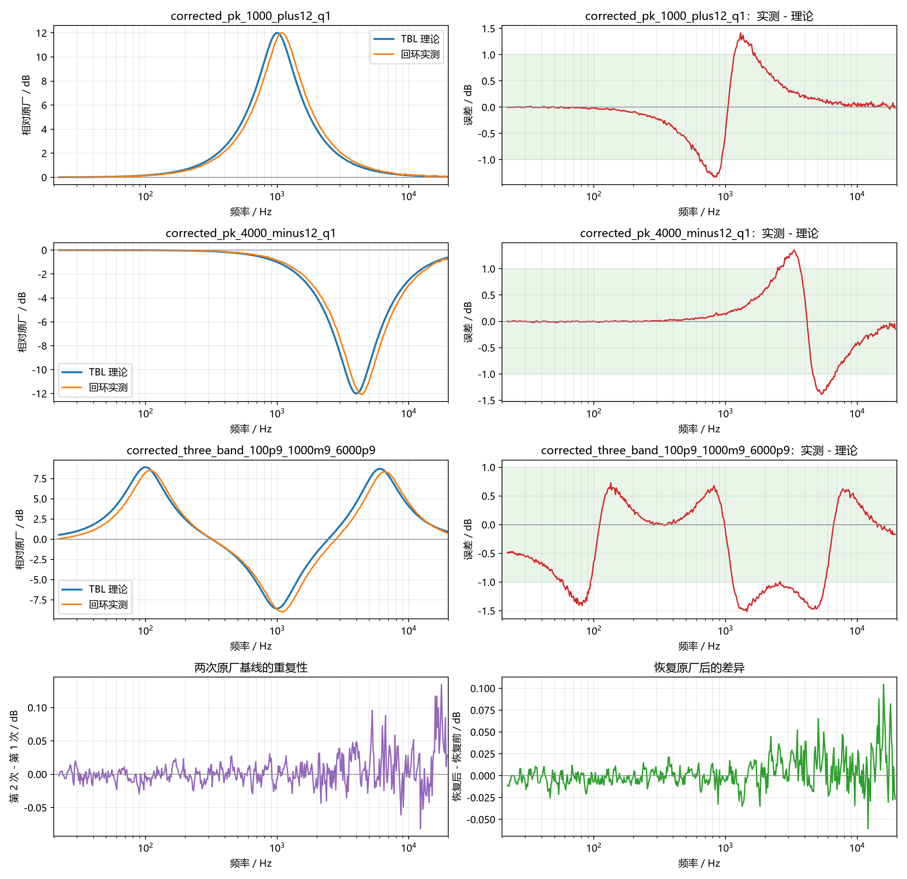
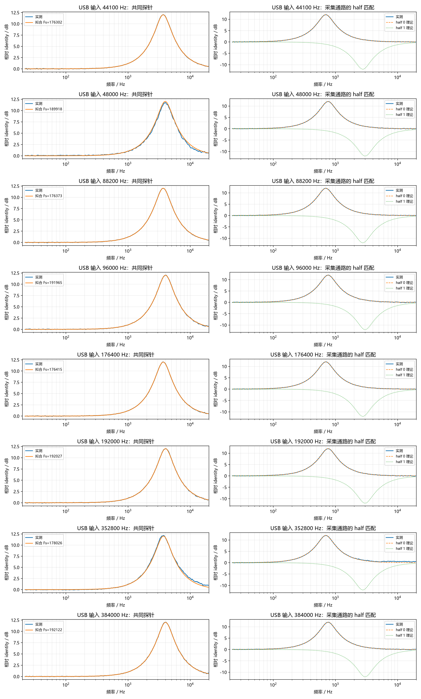
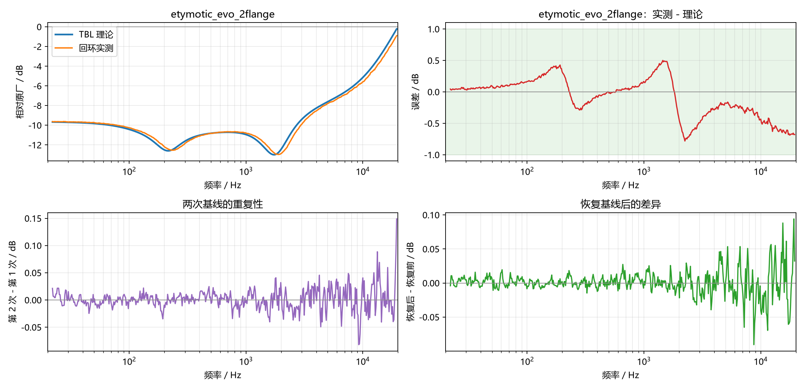

# ZX300A USB DAC 调音表定量验证报告

测试日期：2026-07-25

## 1. 目的与结论

本实验通过真实模拟回环，定量检查三个问题：

1. 写入 CXD3778GF tone table 后，滤波是否真的作用于耳机输出；
2. 五级串联二阶 IIR（biquad）模型能否预测实测频响；
3. 生成系数时使用的采样率是否正确。

结论如下：

- tone table 写入和强制应用路径有效，恢复原厂表也有效；
- 44.1 kHz 家族的 tone IIR 固定运行在约 **176.4 kHz**，48 kHz 家族固定运行
  在约 **192 kHz**；“4 倍”只适用于 44.1/48 kHz 基础档；
- 44.1、48、88.2、96、176.4、192、352.8、384 kHz 八档 USB PCM 输入均实测
  tone 生效，相对输入倍率依次约为 4×、2×、1×、0.5×；
- 关闭 DSEE 和其他音效后重新完成八档矩阵，并对异常点复测；固定 family
  时钟最大绝对误差为 `0.064%`，共同探针最大拟合 RMSE 为 `0.037 dB`；
- 使用 192 kHz 生成系数后，1 kHz `+12 dB` 实测为 `+11.61 dB`，4 kHz
  `-12 dB` 实测为 `-11.59 dB`；
- 单段滤波在 30 Hz 至 18 kHz 范围内的理论/实测 RMSE 均约为 `0.51 dB`，
  相关系数约为 `0.988`；
- 两次原厂基线的 RMSE 为 `0.0228 dB`，恢复前后的 RMSE 为 `0.0175 dB`。
- 当前单声道录音线实际采集 WALKMAN 左输出；不对称 half 探针显示该通路在八档
  输入下都读取 half 0，与源码中的 44.1/48 RAM area 命名并不一致。

这组结果确认了我们当前使用的五段 biquad 参数解释和频响计算是正确的，也确认了
自定义 table 能按预期改变硬件频响。它不单独证明芯片内部绝无其他滤波单元，但已经
验证了 table 暴露出的五段能够按级联 biquad 模型工作。八档测试同时修正了早期
“所有输入都按 4 倍运行”的过度概括。






## 2. 测试链路

```text
Windows 44.1 至 384 kHz 测试信号
  -> USB
ZX300A（USB DAC 模式，CXD3778GF tone DSP）
  -> 3.5 mm 模拟输出
OsmoPocket3 录音输入
  -> USB
Windows 录音与分析
```

播放设备为 `Speakers (WALKMAN)`，录音设备为
`Capture Input terminal (OsmoPocket3)`。播放与录音均通过 Windows WDM-KS
独占模式打开，避免系统混音器、音效和其他应用插入测试链路。WALKMAN 输出逐档
切换采样率，Osmo 受设备能力限制始终以 48 kHz 采集；分析时使用有理数
polyphase resampling 把激励转换到采集时钟。激励电平为 `-36 dBFS`，所有录音均未削波。

ADB 使用 `E:\Downloads\platform-tools\adb.exe`，仅负责备份、写入、应用和恢复
tone table。音频设备访问全部在 Windows 完成，以避免 USB 设备跨 WSL 转发造成的不确定性。

## 3. 为什么没有直接使用传统扫频

最初使用单频对数扫频时，OsmoPocket3 的自动增益/动态处理会跟随扫频电平变化。
理论上的约 `12 dB` 峰谷在录音中只剩约 `1 dB`，因此单频扫频不能用于可靠的幅度定量。

最终采用确定性周期宽带噪声。DSEE 关闭的完整矩阵每段使用 8 个周期，异常点
定向复测使用 16 个周期：

- 20 Hz 至 20 kHz 的全部频率同时存在；
- 每个 table 使用完全相同的激励；
- 丢弃前两个周期，其余稳定周期做同步平均；
- 以原厂 table 为参考计算复数频谱比；
- 去除每次录音的单一全局电平偏移，仅比较相对频响。

这样 Osmo 的慢速自动增益主要表现为全频段共同增益，归一化后不会抹平滤波器的频率形状。
原厂基线仅 `0.0228 dB` 的重复性误差也证明该方法足以分辨本实验中的变化。

## 4. 从“4 倍”到固定 family 时钟

先按旧假设，为 48 kHz 生成 RBJ biquad 系数。实测中心频率如下：

| table 设定 | 理论中心（按 192 kHz 重算） | 实测中心附近幅度 | 观察 |
|---|---:|---:|---|
| 1 kHz，+12 dB，Q=1 | 4.025 kHz，+12.00 dB | +11.65 dB | 中心约为设定的 4 倍 |
| 4 kHz，-12 dB，Q=1 | 15.901 kHz，-12.00 dB | -11.52 dB | 中心约为设定的 4 倍 |
| 100 Hz，+9 dB，Q=1 | 398.7 Hz，+8.90 dB | +8.61 dB | 第三个独立的 4 倍证据 |

偏移并非随机误差：使用 192 kHz 重新解释同一组系数后，完整频响与实测高度吻合。
因此可判定，在这条 48 kHz USB DAC 通路中，tone IIR 运行在 192 kHz。

这一步只证明 **48 kHz 基础档**是 4×，不能外推所有采样率。第一轮八档测试时
DSEE 处于开启状态，因此在关闭 DSEE 和其他音效后，对 Windows WDM-KS 可打开
的八档采样率重新逐一回环。共同探针在两个 half 中完全相同，可独立反推实际
tone-DSP 时钟。

DSEE 关闭的首轮完整矩阵中，48 与 352.8 kHz 各出现一次约 1% 的全曲线拟合
异常，但探针中心仍在预期位置。使用 16 个周期定向复测后异常消失，说明它们是
Osmo 动态处理或单次采集扰动。下表对这两档采用复测值：

| USB 输入 | 拟合 DSP Fs | 相对输入倍率 | 相对 family 固定时钟误差 | RMSE | 数据来源 |
|---:|---:|---:|---:|---:|:---:|
| 44.1 kHz | 176302 Hz | 3.9978× | -0.056% | 0.028 dB | 完整矩阵 |
| 48 kHz | 192031 Hz | 4.0007× | +0.016% | 0.025 dB | 16 周期复测 |
| 88.2 kHz | 176373 Hz | 1.9997× | -0.015% | 0.025 dB | 完整矩阵 |
| 96 kHz | 191965 Hz | 1.9996× | -0.018% | 0.037 dB | 完整矩阵 |
| 176.4 kHz | 176415 Hz | 1.0001× | +0.009% | 0.027 dB | 完整矩阵 |
| 192 kHz | 192027 Hz | 1.0001× | +0.014% | 0.036 dB | 完整矩阵 |
| 352.8 kHz | 176339 Hz | 0.4998× | -0.034% | 0.022 dB | 16 周期复测 |
| 384 kHz | 192122 Hz | 0.5003× | +0.064% | 0.031 dB | 完整矩阵 |

正确模型因此是：

```text
44.1 / 88.2 / 176.4 / 352.8 kHz 输入 -> tone DSP 约 176.4 kHz
48   / 96   / 192   / 384   kHz 输入 -> tone DSP 约 192.0 kHz
```

关闭 DSEE 后八档最大时钟误差只有 `0.064%`，固定 family 时钟模型得到直接支持。
352.8/384 kHz 下共同探针仍有约 12 dB 峰值，也证明
`sound_effect && sample_rate <= 192000` 这一音量表条件不代表 tone RAM 在
更高采样率下旁路。DSEE 开启和关闭两轮都支持同一时钟模型；由于 Osmo 存在动态
增益和偶发曲线扰动，不能把两轮个别拟合差值解释成 DSEE 改变了 tone-DSP 时钟。

旧系数的时钟校准图和数据保存在：

- `samples/measurements/zx300a-usb-dac-clock-calibration/frequency_response.png`
- `samples/measurements/zx300a-usb-dac-clock-calibration/frequency_response.csv`
- `samples/measurements/zx300a-usb-dac-clock-calibration/metrics.json`

DSEE 关闭的完整矩阵、定向复测和两轮对比保存在：

- `samples/measurements/zx300a-usb-dac-all-sample-rates-dsee-off/full/`
- `samples/measurements/zx300a-usb-dac-all-sample-rates-dsee-off/outlier-repeat/`
- `samples/measurements/zx300a-usb-dac-all-sample-rates-dsee-off/comparison/`

## 5. RAM half / area 的额外发现

内核源码定义：

```c
#define CODEC_RAM_441_AREA 0x00
#define CODEC_RAM_480_AREA 0x20
```

320 字节表正好对应两个 32-word area。为检查当前通路实际读取哪一半，实验在
half 0 写入 `700 Hz/+12 dB`，在 half 1 写入 `3 kHz/-12 dB`。八档采样率的
实测曲线都匹配 half 0；按每档真实 family 时钟重算并采用复测结果后，half 0
匹配 RMSE 为 `0.019–0.042 dB`。

左右声道单独播放又确认当前单声道录音线只采集 WALKMAN 左输出：左声道激励比
右声道高 `34.93 dB`。所以目前能够下的严格结论是：

- ZX300A、当前 `TYPE_Z` 强制 apply、USB DAC、3.5 mm 左输出读取 half 0；
- 不能用当前线缆判断右模拟输出是否读取 half 1；
- 当前路径没有表现出源码命名所暗示的 44.1/48 area 自动切换；
- 生成器保留 176.4/192 kHz 双 area 默认值，因为源码命名和 Sony 原厂表系数
  仍支持这一布局，但在此 ZX300A 强制加载路径上不能把切换视为已验证事实。

若实验只针对 USB DAC 48 kHz，可用 `--fs441 192000 --fs48 192000` 让两个 half
都按 192 kHz 生成；这样的表不应再用于要求 44.1 kHz 精确中心频率的播放通路。

## 6. 192 kHz 系数验证结果

| 测试 table | 关注频率理论值 | 关注频率实测值 | 30 Hz-18 kHz RMSE | 1-6 kHz RMSE | 相关系数 |
|---|---:|---:|---:|---:|---:|
| 1 kHz，+12 dB，Q=1 | +12.00 dB | +11.61 dB | 0.512 dB | 0.687 dB | 0.9880 |
| 4 kHz，-12 dB，Q=1 | -12.00 dB | -11.59 dB | 0.511 dB | 0.845 dB | 0.9883 |
| 100/+9、1k/-9、6k/+9 dB | 100 Hz: +8.90 dB | 100 Hz: +8.25 dB | 0.814 dB | 1.214 dB | 0.9882 |

三段同时启用时仍保持高度相关，说明多段级联的实现与理论一致。误差主要来自
OsmoPocket3 的不可关闭动态处理、模拟链路噪声、有限频率分辨率和 CXD3778GF
定点系数量化；当前数据没有显示滤波方向颠倒、段间顺序异常或明显的不稳定行为。

完整数据：

- `samples/measurements/zx300a-usb-dac-4x-clock-corrected/frequency_response.csv`
- `samples/measurements/zx300a-usb-dac-4x-clock-corrected/metrics.json`

## 7. 适用范围与限制

- **已验证：** ZX300A、USB DAC 模式、八档 PCM 输入、单端 3.5 mm 左输出、
  DSEE/其他音效关闭、table 5 / `tct_sg` 强制加载通路。
- **尚未验证：** ZX300A 本机播放器通路、右声道、平衡输出，以及其他 A/ZX/WM
  型号是否使用相同的固定 family tone DSP 时钟和 RAM area 选择。
- OsmoPocket3 不是测量声卡，因此本报告适合验证滤波形状、中心频率和大幅度增益，
  不应被当作播放器绝对失真、噪声或高精度幅相指标。
- 主生成器已经采用本次实测支持的 176.4/192 kHz 默认值，同时保留
  `--fs441` / `--fs48` 参数。尚未测量的设备或播放通路可以显式覆盖，
  不应把默认值当作所有 CXD3778GF 设备均已验证的结论。

## 8. 完整复现命令

开始前暂停 Windows 和播放器上的所有其他音频，让 ZX300A 进入 USB DAC 模式，
关闭 DSEE、EQ 和其他音效，确认 3.5 mm 输出已连接 OsmoPocket3 录音输入。

```powershell
cd D:\Documents\zx300-custom-kernel\walkman-tuning-guide
C:\Python312\python.exe -m pip install -r requirements.txt

# 传统对数扫频，仅用于复现 Osmo 自动增益的限制。
powershell -ExecutionPolicy Bypass -File `
  .\experiments\reproduce\40_zx300a_usb_dac_loopback_sweep.ps1 `
  -OutputDir experiments\measurements\zx300a-usb-dac-sweep

# 用旧 44.1/48 kHz 系数测出 4 倍中心频率偏移。
powershell -ExecutionPolicy Bypass -File `
  .\experiments\reproduce\41_zx300a_usb_dac_periodic_noise.ps1 `
  -OutputDir experiments\measurements\zx300a-usb-dac-clock-calibration `
  -LevelDbfs -32 -Periods 16

# 用 176.4/192 kHz 系数完成最终验证。
powershell -ExecutionPolicy Bypass -File `
  .\experiments\reproduce\42_zx300a_usb_dac_4x_clock_corrected.ps1 `
  -OutputDir experiments\measurements\zx300a-usb-dac-4x-clock-corrected `
  -LevelDbfs -32 -Periods 16

# 八档输入、固定 family 时钟、活动 half 和左右声道映射的完整测试。
powershell -ExecutionPolicy Bypass -File `
  .\experiments\reproduce\45_measure_zx300a_all_sample_rates.ps1 `
  -OutputDir experiments\measurements\zx300a-usb-dac-all-sample-rates-dsee-off

# 对首轮异常的 48/352.8 kHz 使用 16 周期复测。
powershell -NoProfile -Command "& {
  .\experiments\reproduce\45_measure_zx300a_all_sample_rates.ps1 `
    -OutputDir experiments\measurements\zx300a-usb-dac-dsee-off-outlier-repeat `
    -Periods 16 -Rates @(48000,352800) -SkipChannelMap
}"

# 从归档指标重建 DSEE 开关对比报告，不访问设备。
powershell -ExecutionPolicy Bypass -File `
  .\experiments\reproduce\46_compare_zx300a_dsee_sample_rate_runs.ps1
```

脚本只会在音频流关闭后写 table；恢复时会为 2880 字节 table body 添加 Sony
8 字节校验和，再写回 2888 字节完整 table。不要在播放/录音流活跃时手工向
`/proc/icx_audio_cxd3778gf_data/tct` 写入。

## 9. 测试结束状态

早期原厂/探针实验结束后均恢复当时的原厂 table。安装 Etymotic EVO 后，八档
实验的 `finally` 块重新应用持久化的 `auto_tct.tbl`。当前设备报告：

```text
inferred_tone_table=5(tct_sg/samp_general_hp)
auto_tct_md5=1d424de96d577e11c7acda15c1845c60
last_result=0
```

因此全采样率测试结束后没有把探针表留在运行时。

## 10. 五段 Etymotic EVO 复合滤波回测与解释修正

算法修正后，使用 Etymotic EVO（2-flange eartips）的完整五段 AutoEq 参数做了
第二组独立回环。为了避免依赖 Sony 原厂文件，基线使用工具现场生成的五段
identity 完整表；这与 ZX300A stock `sg` chunk 的滤波响应等价。

| 指标 | 结果 |
|---|---:|
| 30 Hz-18 kHz RMSE | 0.317 dB |
| 1-6 kHz RMSE | 0.408 dB |
| 30 Hz-18 kHz MAE | 0.254 dB |
| 最大绝对误差 | 0.782 dB |
| 理论/实测相关系数 | 0.9955 |
| 两次 identity 基线重复性 | 0.0179 dB |
| identity 恢复差异 | 0.0178 dB |

这次测试同时覆盖 LSC、三个 PK/HSC 组合、`-10.643 dB` 自动安全 preamp、
Q37 段间增益分配和五段同时级联。表格中的 `0.317 dB` 是实测相对**目标
48 kHz family 曲线**的误差。

八档 half 探针完成后重新审计发现：同一段 EVO 录音与 **half 0 系数在 192 kHz
执行**的响应相比，RMSE 只有 `0.0235 dB`、相关系数为 `0.99996`。这证明硬件
极准确地执行了 half 0，却也证明它没有在该 48 kHz 左输出测试中读取为 192 kHz
生成的 half 1。先前把 `0.317 dB` 全部归因于录音设备误差并不严谨；其中包含
half 0 系数从 176.4 kHz 转到 192 kHz 执行造成的约 8.84% 频率轴偏移。

因此 EVO 回测仍然有力验证了 Q37 编码和五段级联，但不能再作为 dual-area 自动
切换的证据。默认双 family 表对 Sony 预期布局仍合理；针对当前 USB DAC 48 kHz
左输出做高精度校正时，应把两半都按 192 kHz 生成。



复现脚本：

```powershell
powershell -ExecutionPolicy Bypass -File `
  .\experiments\reproduce\44_measure_etymotic_evo_2flange_loopback.ps1
```
