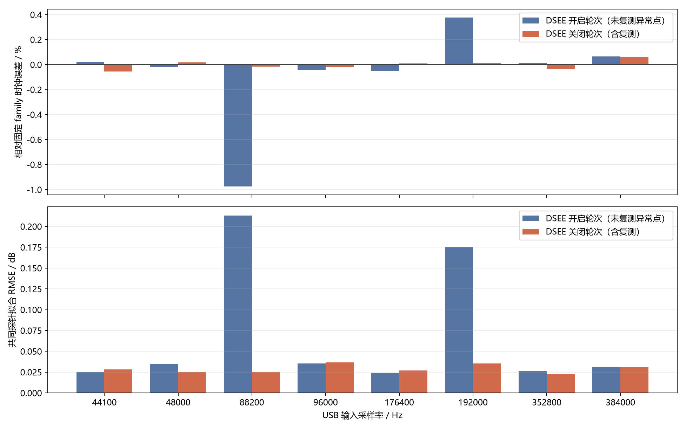

# ZX300A USB DAC DSEE 开关采样率对比

## 结论

- DSEE 关闭后八档 tone table 均生效；固定 family 时钟最大绝对误差为 0.064%。
- DSEE 关闭结果的共同探针最大拟合 RMSE 为 0.037 dB。
- DSEE 关闭后当前采集通路匹配的 half 集合为 `[0]`。
- 两轮都支持 44.1 kHz 家族约 176.4 kHz、48 kHz 家族约 192 kHz 的固定时钟模型。
- DSEE 开启轮次与关闭轮次都出现过单次采集异常；关闭轮次用 16 周期定向复测替换了 48/352.8 kHz 异常点。
- 因此不能把两轮个别拟合差值解释成 DSEE 改变了 tone-DSP 时钟。
- OsmoPocket3 存在动态增益，不能用跨轮次绝对录音电平定量判断 DSEE 增益。

| USB 输入 | DSEE 开启拟合 Fs | DSEE 关闭拟合 Fs | 关闭误差 | 关闭 RMSE | 关闭数据来源 | half |
|---:|---:|---:|---:|---:|:---:|:---:|
| 44100 Hz | 176438 Hz | 176302 Hz | -0.056% | 0.028 dB | 完整矩阵 | 0 |
| 48000 Hz | 191960 Hz | 192031 Hz | +0.016% | 0.025 dB | 定向复测 | 0 |
| 88200 Hz | 174678 Hz | 176373 Hz | -0.015% | 0.025 dB | 完整矩阵 | 0 |
| 96000 Hz | 191920 Hz | 191965 Hz | -0.018% | 0.037 dB | 完整矩阵 | 0 |
| 176400 Hz | 176313 Hz | 176415 Hz | +0.009% | 0.027 dB | 完整矩阵 | 0 |
| 192000 Hz | 192725 Hz | 192027 Hz | +0.014% | 0.036 dB | 完整矩阵 | 0 |
| 352800 Hz | 176424 Hz | 176339 Hz | -0.034% | 0.022 dB | 定向复测 | 0 |
| 384000 Hz | 192126 Hz | 192122 Hz | +0.064% | 0.031 dB | 完整矩阵 | 0 |

