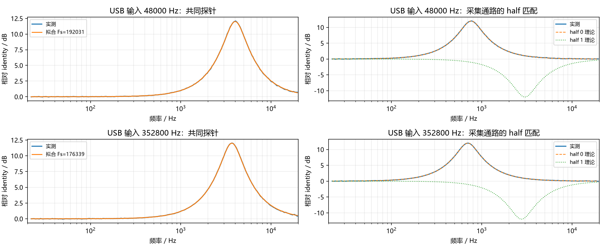

# ZX300A USB DAC 全采样率 tone-DSP 回环报告

> 本报告只包含 DSEE 关闭状态下 48/352.8 kHz 的 16 周期定向复测。

## 结论

- 44.1 kHz 家族在全部四档输入下均符合约 176.4 kHz 的固定 tone-DSP 时钟。
- 48 kHz 家族在全部四档输入下均符合约 192 kHz 的固定 tone-DSP 时钟。
- 因而相对 USB 输入的倍率依次为约 4×、2×、1×、0.5×；“4×”只适用于 44.1/48 kHz 基础档。
- 352.8/384 kHz 输入下 tone table 仍然生效，没有在 192 kHz 以上旁路。

| USB 输入 | tone 生效 | 拟合 DSP Fs | 相对输入倍率 | 相对 family 固定时钟误差 | 共同探针 RMSE | 采集通路匹配 | half RMSE |
|---:|:---:|---:|---:|---:|---:|:---:|---:|
| 48000 Hz | 是 | 192031 Hz | 4.0007x | +0.016% | 0.025 dB | half 0 | 0.024 dB |
| 352800 Hz | 是 | 176339 Hz | 0.4998x | -0.034% | 0.022 dB | half 0 | 0.019 dB |

- 共同探针在两个 half 中写入完全相同的 1 kHz/+12 dB 系数，系数参考时钟为 48 kHz。
- WALKMAN 由 Windows WDM-KS 分别以八档采样率独占播放；OsmoPocket3 固定以 48 kHz 采集，分析时对激励做 polyphase 重采样。
- 拟合只移除一个全频段常量电平偏差，没有缩放曲线。
- half 探针为 half 0 的 700 Hz/+12 dB 与 half 1 的 3 kHz/-12 dB。
- 八档结果都表示当前模拟采集通路与 half 0（源码名 `CODEC_RAM_441_AREA`）的探针曲线一致；它与源码暗示的自动 family area 切换并不一致。
- 详细曲线见 `frequency_response.csv`，自动对齐信息见 `metrics.json`。

完整复现脚本：`experiments/reproduce/45_measure_zx300a_all_sample_rates.ps1`。
