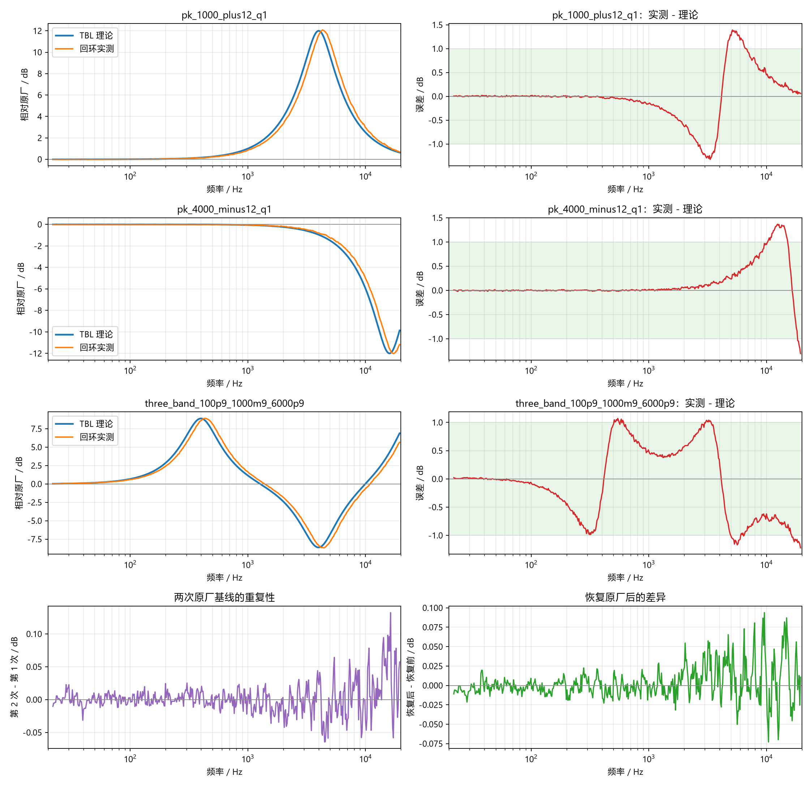

# ZX300A USB DAC 回环扫频测试报告

- 电脑侧采样率：48000 Hz；tone IIR 实际运行采样率：192000 Hz。

## 测试指标

| 配置 | 30 Hz-18 kHz RMSE | 1-6 kHz RMSE | 相关系数 | 关键频点理论 | 关键频点实测 |
|---|---:|---:|---:|---:|---:|
| pk_1000_plus12_q1 | 0.51 dB | 0.84 dB | 0.9884 | 4025 Hz / +12.00 dB | 4025 Hz / +11.65 dB |
| pk_4000_minus12_q1 | 0.38 dB | 0.15 dB | 0.9962 | 15901 Hz / -12.00 dB | 15901 Hz / -11.52 dB |
| three_band_100p9_1000m9_6000p9 | 0.64 dB | 0.71 dB | 0.9881 | 399 Hz / +8.90 dB | 399 Hz / +8.61 dB |

- 两次原厂基线的形状重复性 RMSE：0.023 dB。
- 恢复原厂后相对恢复前的 RMSE：0.022 dB。
- 对每个自定义配置仅移除了一个全频段常量电平偏差；曲线形状没有做拟合或缩放。
- 详细数据见 `frequency_response.csv`，自动对齐诊断见 `metrics.json`。

